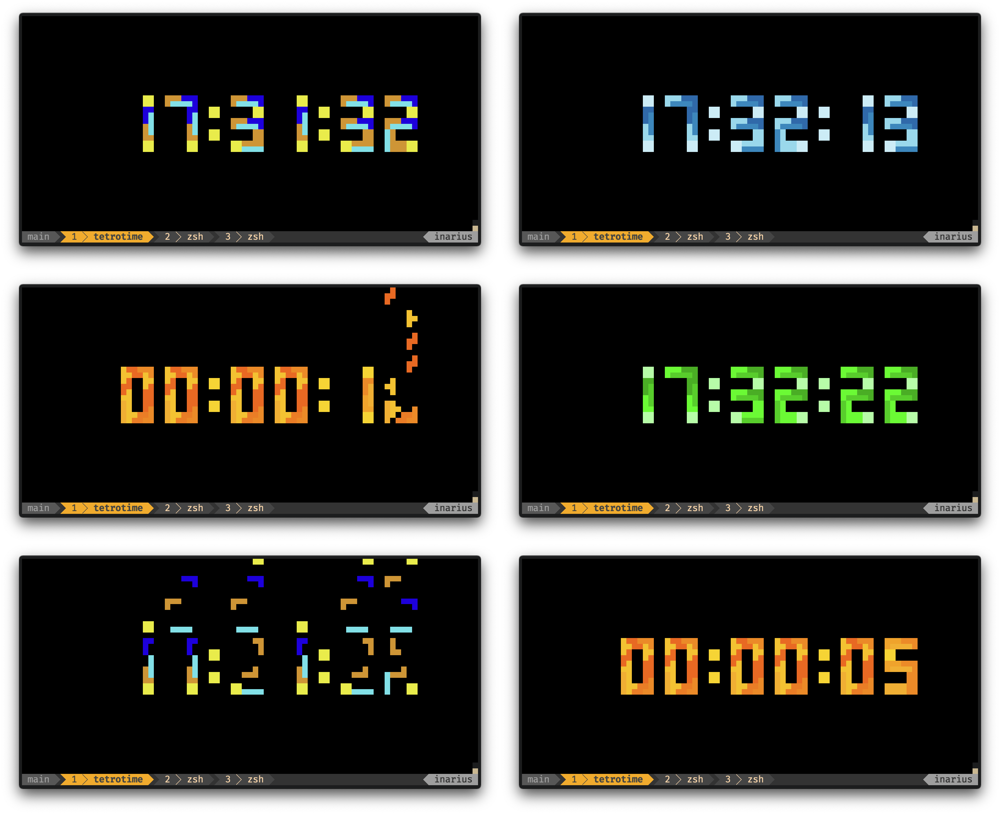

# TetroTime

A terminal clock powered by the tetrominos from your childhood.



Built with [pixel_loop](https://crates.io/crates/pixel_loop). Live-coded on
YouTube at [MrJakob](https://youtube.com/c/mrjakob).

## Installation

```bash
cargo install tetrotime
```

Pre-built binaries for macOS, Linux, and Windows are available on the
[GitHub Releases](https://github.com/jakobwesthoff/tetrotime/releases) page.

## Quick Start

```bash
tetrotime                      # Clock showing current local time
tetrotime --stopwatch          # Stopwatch counting up from 00:00:00
tetrotime --countdown 00:05:00 # 5-minute countdown timer
```

Resize your terminal window until the digits fit comfortably. Press `Q` to quit.

<!-- docs:start -->
## Documentation

Tetrotime renders time as tetromino-styled digits in your terminal — tetrominos
drop from the top and stack up to form each digit. When the time changes, old
pieces scatter and new ones fall into place. It supports three modes (clock,
stopwatch, countdown) and ships with 12 colorschemes.

```bash
tetrotime [OPTIONS]
```

### CLI Options

| Option | Default | Description |
|--------|---------|-------------|
| `-c, --clock` | | Show a clock (default mode) |
| `-w, --stopwatch` | | Show a stopwatch |
| `-d, --countdown <DURATION>` | | Show a countdown timer (duration as `HHMMSS` or `HH:MM:SS`) |
| `-s, --colorscheme <SCHEME>` | original | Select a colorscheme |
| `-h, --help` | | Print help |

### Modes

Tetrotime has three modes. If none is specified, it defaults to clock.

**Clock** shows the current local time as `HH:MM:SS`:

```bash
tetrotime
tetrotime --clock
```

**Stopwatch** counts up from `00:00:00` starting at launch:

```bash
tetrotime --stopwatch
tetrotime -w
```

**Countdown** counts down from a given duration to `00:00:00`. Accepts
`HH:MM:SS` or `HHMMSS` format:

```bash
tetrotime --countdown 00:05:00  # 5 minutes
tetrotime -d 013000             # 1 hour 30 minutes
tetrotime -d 000030             # 30 seconds
```

### Colorschemes

Tetrotime ships with 12 colorschemes. Pass one with `-s` or `--colorscheme`:

```bash
tetrotime -s neon
tetrotime --colorscheme ocean
```

| Name | Description |
|------|-------------|
| **original** (default) | The classic — bright, bold tetromino colors |
| grayscale | Monochrome shades for a minimalist terminal |
| position | Each digit position gets its own color — a rainbow across the clock |
| digit | Colors tied to the digit value, so every 3 looks the same wherever it appears |
| neon | Glowing cyberpunk vibes on a dark terminal |
| pastel | Soft and muted, easy on the eyes |
| ocean | Blues and turquoises from somewhere deep underwater |
| autumn | Reds, browns, and golden tones — leaves falling, not just tetrominos |
| christmas | Festive reds, greens, and gold |
| warm | Yellows and oranges, like staring into a fireplace |
| matrix | Green phosphor — you'll see the code eventually |
| purple | Deep violet and plum tones |

### Controls

- Press `Q` to quit
- The display adapts to your terminal size automatically — resize the window for
  best results

<!-- docs:end -->

## Development

```bash
git clone https://github.com/jakobwesthoff/tetrotime.git
cd tetrotime
cargo build --release
cargo run
```

## License

MIT License, Copyright &copy; 2024-2026 Jakob Westhoff

See [LICENSE](LICENSE) for the full text.
